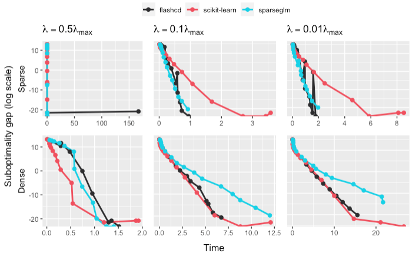

# sparseglm


A fast and modular coordinate descent solver for sparse generalized linear models
with **convex** and **non-convex** penalties.

The optimization algorithm is explained [here](https://arxiv.org/abs/2204.07826).
This work has been accepted at NeurIPS 2022.
It offers theoretical guarantees of convergence and demonstrates the superiority
of this solver over existing alternatives. The original package written in pure Python can be found
here: [skglm](https://github.com/scikit-learn-contrib/skglm).

`sparseglm` leverages [Anderson acceleration](https://github.com/mathurinm/andersoncd)
and [working sets](https://github.com/scikit-learn-contrib/skglm) to propose a **fast** and
**memory-efficient** solver on a wide variety of algorithms. It can solve problems
with millions of samples and features in seconds. It supports **dense** and
**sparse** matrices via CSC arrays.

The philosophy of `sparseglm` lies in providing a highly flexible API.
By supplying the datafit term and penalty term, one can implement any sparse Generalized Linear Model (GLM) in under 30 lines of code, making it effortless to introduce new estimators.

```rust
// Load data and wrap them in a Dataset
let dataset = DatasetBase::from((x, y));

// Define a datafit (here a quadratic datafit for regression)
let mut datafit = Quadratic::new();

// Define a penalty (here a L1 penalty for Lasso)
let penalty = L1::new(0.7);

// Instantiate a Solver with default parameters
let solver = Solver::new();

// Solve the problem using coordinate descent
let coefficients = solver.solve(&dataset, &mut datafit, &penalty).unwrap();
```

For the most well-known models like `Lasso` or `ElasticNet`, `sparseglm` already have off-the-shelf
implementations.

```rust
// Load data and wrap them in a Dataset
let dataset = DatasetBase::from((x, y));

// Instantiate and fit the estimator
let estimator = Lasso::params()
                  .alpha(2.)
                  .fit(&dataset)
                  .unwrap();

// Get the fitted coefficients
let coefficients = estimator.coefficients();
```

## Performance

### Lasso

We provide below a demonstration of `sparseglm` against other fast coordinate
descent solvers using the optimization benchmarking tool [Benchopt](https://github.com/benchopt/benchopt).
The benchmark below solves a Lasso optimization problem. We select three solvers:
[scikit-learn](https://github.com/scikit-learn/scikit-learn), [celer](https://github.com/mathurinm/celer)
and `sparseglm`. The solvers are tested at different level of regularization from high sparsity to low
sparsity.


The simulations were made on two different datasets: one sparse and one dense.
[rcv1](https://scikit-learn.org/0.18/datasets/rcv1.html) is a dataset made of more than 804,414 samples
and 47,236 features. The data comes in the form of a sparse matrix.
For the dense dataset, we simulated a dense design matrix of 1,000 samples and 10,000 features.

### Multi-Task Lasso



The simulations were made on two different datasets: one sparse and one dense.
Both datasets contain 100 samples, 3,000 samples and 80 tasks.

## Roadmap

Currently we support:

| Model                      |    Single task     |     Multi task     | Convexity  |
| -------------------------- | :----------------: | :----------------: | :--------: |
| Lasso                      | :heavy_check_mark: | :heavy_check_mark: |   Convex   |
| MCP                        | :heavy_check_mark: | :heavy_check_mark: | Non-convex |
| Elastic-Net                | :heavy_check_mark: | :heavy_check_mark: |   Convex   |
| L0.5                       | :heavy_check_mark: | :heavy_check_mark: | Non-convex |
| Indicator box              |         -          |         -          |   Convex   |
| Sparse logistic regression | :heavy_check_mark: |         -          |   Convex   |
| Dual SVM with hinge loss   |         -          |         -          |   Convex   |

## Building and installing the Python package locally

This repo includes Python bindings to run the existing estimators (in the `Estimators` crate)
in a Python environment. To install it, run at the root of the repo:

```bash

# Install requirements
pip install -r requirements.txt

# Compile and build Python wheel
cd python
python ./setup.py install
```

## Contributing

### Testing

To run the tests, run:

```shell
cargo test
```

### Benchmarking

The crates also features benchmarks. To run them, run:

```shell
cargo bench
```
