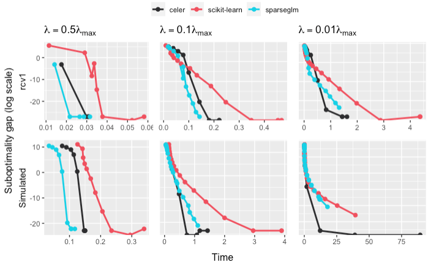

# sparseglm


A fast and modular coordinate descent solver for sparse generalized linear models
with **convex** and **non-convex** penalties.

The details of the `sparseglm` solver are explored in [CITE PAPER]. It provides
theoretical guarantees of convergence and extensively demonstrates the superiority
of this solver over existing ones. A similar package written in pure Python can be found
here: [FlashCD](https://github.com/mathurinm/flashcd).

`sparseglm` leverages [Anderson acceleration](https://github.com/mathurinm/andersoncd)
and [working sets](https://github.com/mathurinm/celer) to propose a **fast** and
**memory-efficient** solver on a wide variety of algorithms. It can solve problems
with millions of samples and features in seconds. It supports **dense** and
**sparse** matrices via CSC arrays.

The philosophy of `sparseglm` consists in offering a highly flexible API.
Any sparse GLM can be implemented in under 50 lines of code by providing its datafit
term and its penalty term, which makes it very easy to support new estimators.

```rust
// Load some data and wrap them in a Dataset
let dataset = DatasetBase::from((x, y));

// Define a datafit (here a quadratic datafit for regression)
let mut datafit = Quadratic::new();

// Define a penalty (here a L1 penalty for Lasso)
let penalty = L1::new(0.7);

// Instantiate a Solver with default parameters
let solver = Solver::new();

// Solve the problem using coordinate descent
let coefficients = solver.solve(&dataset, &mut datafit, &penalty).unwrap();
```

For widely-known models like Lasso, `sparseglm` already implements
these estimators and offers an API à la `Scikit-Learn`.

```rust
// Load some data and wrap them in a Dataset
let dataset = DatasetBase::from((x, y));

// Instantiate and fit the estimator
let estimator = Lasso::params()
                  .alpha(2.)
                  .fit(&dataset)
                  .unwrap();

// Get the fitted coefficients
let coefficients = estimator.coefficients();
```

## Performance

### Lasso

We provide below a demonstration of `sparseglm` against other fast coordinate
descent solvers using the optimization benchmarking tool [Benchopt](https://github.com/benchopt/benchopt).
The benchmark below solves a Lasso optimization problem. We select three solvers:
[scikit-learn](https://github.com/scikit-learn/scikit-learn), [celer](https://github.com/mathurinm/celer)
and `sparseglm`. The solvers are tested at different level of regularization from high sparsity to low
sparsity.



The simulations were made on two different datasets: one sparse and one dense.
[rcv1](https://scikit-learn.org/0.18/datasets/rcv1.html) is a dataset made of more than 804,414 samples
and 47,236 features. The data comes in the form of a sparse matrix.
For the dense dataset, we simulated a dense design matrix of 1,000 samples and 10,000 features.

### Multi-task Lasso

[INSERT IMAGE]

## Roadmap

Currently we support:

| Model                      |    Single task     |     Multi task     | Convexity  |
| -------------------------- | :----------------: | :----------------: | :--------: |
| Lasso                      | :heavy_check_mark: | :heavy_check_mark: |   Convex   |
| MCP                        | :heavy_check_mark: | :heavy_check_mark: | Non-convex |
| Elastic-Net                | :heavy_check_mark: | :heavy_check_mark: |   Convex   |
| L0.5                       | :heavy_check_mark: | :heavy_check_mark: | Non-convex |
| L2/3                       |         -          |         -          | Non-convex |
| SCAD                       |         -          |         -          | Non-convex |
| Indicator box              |         -          |         -          |   Convex   |
| Sparse logistic regression | :heavy_check_mark: |         -          |   Convex   |
| Dual SVM with hinge loss   |         -          |         -          |   Convex   |

## Building and installing the Python package locally

This repo includes Python bindings to run the existing estimators (in the `Estimators` crate)
in a Python environment. To install it, run at the root of the repo:

```bash

# Install requirements
pip install -r requirements.txt

# Compile and build Python wheel
cd python
python ./setup.py install
```
